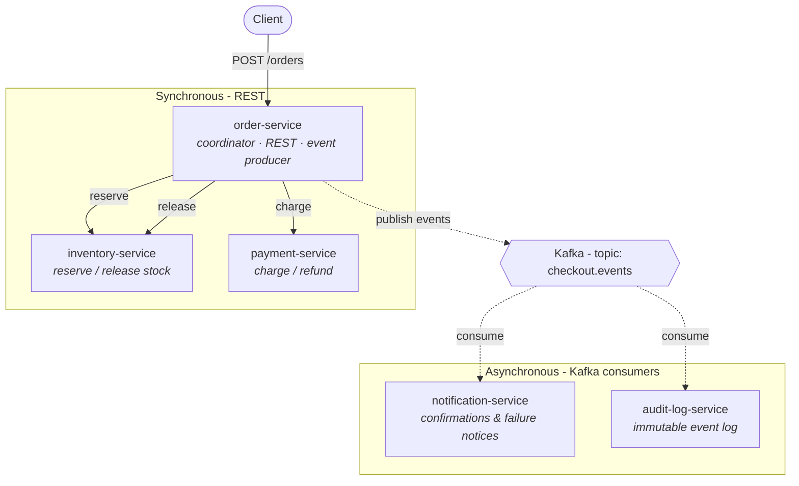

# switchback-checkout

[](https://github.com/andy327/switchback-checkout/actions/workflows/ci.yml)
[](https://www.scala-lang.org/)
[](https://opensource.org/licenses/MIT)

A Scala microservices system that implements an e-commerce checkout across five services. It uses synchronous REST calls between services for the steps an order can't proceed without, and asynchronous Kafka events for the work that can happen independently - switching between the two depending on what each step needs.

## Communication model

A checkout request involves two kinds of interaction, handled differently:

- **Synchronous REST** for the steps the order can't proceed without. order-service can't confirm an order until stock is reserved and the card is charged, and a failed charge has to be undone before it can answer the client - so reserving stock and charging payment are direct REST calls that block until they return.
- **Asynchronous Kafka events** for the work that doesn't hold up the response. Sending a confirmation and recording an audit entry have no bearing on whether the order succeeds, so order-service publishes an event and returns immediately; other services consume it on their own schedule and can lag, retry, or restart without affecting the checkout.

## Services

- **order-service** - the entry point and coordinator. Exposes `POST /orders`, calls inventory and payment in sequence, issues the compensating stock release if payment fails, decides the final order outcome, and publishes checkout events to Kafka. It is the only service that calls the others.
- **inventory-service** - a REST service that reserves and releases stock. `reserve` fails when a SKU can't cover the requested quantity; `release` (used to undo a reservation) is idempotent, so it can be safely retried.
- **payment-service** - a REST service that charges and refunds payments. Includes a deterministic decline rule so the payment-failure path can be reproduced on demand.
- **notification-service** - consumes checkout events from Kafka and sends order confirmations and failure notices. It has no REST interface.
- **audit-log-service** - consumes the same events and appends every one to an ordered, immutable log. It runs independently of notification-service, under its own consumer group.

## The checkout flow

**Happy path** - `POST /orders`:

1. order-service calls inventory-service `reserve` (sync REST) and waits.
2. order-service calls payment-service `charge` (sync REST) and waits.
3. Both succeed → order-service publishes `OrderPlaced` (and the per-step events) to Kafka.
4. order-service returns `201 Confirmed` to the client.
5. notification-service and audit-log-service consume the events asynchronously, each at its own pace. If either is down, the customer already has their answer.

**Payment failure** - a declined charge triggers compensation:

1. `reserve` succeeds (sync REST).
2. `charge` returns `402` (sync REST).
3. order-service issues a compensating `release` call (sync REST) to undo the reservation.
4. order-service publishes `OrderFailed` to Kafka.
5. order-service returns `402 Failed` to the client; the consumers fold in the failure asynchronously.

## Architecture

In the diagram, **solid** arrows are synchronous REST calls (the caller waits for a response) and **dashed** arrows are asynchronous Kafka messages (the sender doesn't wait). The `release` call is made only when a payment is declined.



- **order-service** owns the flow. It is the only service that talks to the others; the two REST services and the two consumers never call each other.
- Because order-service depends on inventory and payment being responsive, its calls to them retry briefly on transient errors and, if a service keeps failing, stop calling it and fail fast for a short cooldown - so one struggling dependency doesn't leave every checkout hanging on a timeout.
- **Kafka** carries the full checkout event stream on a single topic. Both consumers subscribe independently under their own consumer groups; neither is aware of the other.
- Each service keeps its own state in memory (the audit log is append-only). There is no shared datastore, and no service reaches into another's state - they interact only through the REST calls and events above.

## Tech stack

| Area | Technologies |
|------|--------------|
| Language & runtime | Scala 2.13, Cats Effect 3, fs2 |
| REST (server + client) | Tapir, http4s Ember, sttp |
| Messaging | Apache Kafka, fs2-kafka |
| Serialization | Circe (JSON) |
| Resilience | Retries with backoff (cats-retry) and fail-fast handling of an unresponsive dependency |
| Config | Ciris (environment-driven) |
| Build & CI | sbt (multi-module), GitHub Actions |
| Infra | Docker / Docker Compose |
| Testing | ScalaTest, cats-effect-testing, Testcontainers (Kafka) |

Each REST endpoint is defined once with Tapir and used to generate both the server route that serves it and the client that calls it, so a change to a request or response type is caught at compile time rather than as a runtime error.

## Project structure

```
common/                 - shared domain model, Circe codecs, checkout event schema,
                          Kafka topic names, and the Tapir endpoint definitions
order-service/          - coordinator: REST entry point, REST clients, Kafka producer
inventory-service/      - REST: reserve / release stock
payment-service/        - REST: charge / refund (with a deterministic decline rule)
notification-service/   - Kafka consumer: confirmations and failure notices
audit-log-service/      - Kafka consumer: appends every event to an immutable log
docker/                 - Docker Compose (Kafka + Zookeeper)
```

## Running locally

> **Status:** the build, module layout, shared contract, and Compose setup are in place; the service internals are still being implemented. The commands below describe the intended local workflow.

You'll need a JDK (17+), [sbt](https://www.scala-sbt.org/), and Docker. Start Kafka, then run each service from sbt in its own shell:

```bash
docker compose -f docker/docker-compose.yml up -d
```

```bash
sbt "inventory-service/run"     # :8081
sbt "payment-service/run"       # :8082
sbt "order-service/run"         # :8080  (entry point)
sbt "notification-service/run"  # consumes checkout.events
sbt "audit-log-service/run"     # consumes checkout.events
```

Place an order:

```bash
curl -X POST http://localhost:8080/orders \
  -H 'content-type: application/json' \
  -d '{"customerId":"c1","items":[{"sku":"widget","quantity":2}],"amount":{"amountCents":1998,"currency":"USD"},"card":{"token":"tok_ok"}}'
```

## License

This project is licensed under the [MIT License](LICENSE).
